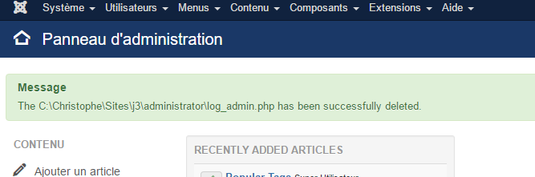

# Joomla log_admin

> ℹ️ **IMPORTANT NOTICE**  This script didn't work for Joomla 4; need refactoring.

> You've forgot your Joomla admin credentials but you 've access to your FTP? The log_admin.php script will allow you to connect in your administrator interface without the need to fill in credentials.

[English version](#english-version) - [Version francophone](#version-francophone)

If you're searching the same tool for WordPress, take a look to [https://github.com/JulioPotier/SecuPress-Backdoor-User](https://github.com/JulioPotier/SecuPress-Backdoor-User)

## Table of Contents

- [English version](#english-version)
- [Version francophone](#version-francophone)
- [License](#license)

## English version

> You don't have (anymore) your Joomla admin login and/or password (or just don't have one) but you've well access to your FTP

### Description

When you don't remember again your super admin account or even password, `log_admin` will allow you to start your administrator interface by, just, putting this script in your `/administrator` folder.

Don't be blocked anymore or don't play anymore with `phpMyAdmin` for creating a new admin / resetting the password / ..., just use this straightforward script.

#### Note

The "official" (= recommended by the Joomla project) way is either to edit the `configuration.php` file or to go `phpMyAdmin` and create a new user / reset an existing user. More info on [https://docs.joomla.org/How_do_you_recover_or_reset_your_admin_password%3F](https://docs.joomla.org/How_do_you_recover_or_reset_your_admin_password%3F)

#### BE CAREFUL!!!

**If you've copied this script onto your website, don't forget it ! The script will be automatically deleted after the first use but ... use it ;-) If the script stay unused, don't forget to delete it.**

### Install

1. Follow the link [log_admin.php](https://raw.githubusercontent.com/cavo789/joomla_log_admin/master/log_admin.php), the source code of the script will be displayed in a tab of your browser.
2. Make a right click and select `Save As` to save the file on your computer. *If your site is local, save directly in the `/administrator` folder of your Joomla site.*
3. If your site is remote, launch your FTP client, connect to your site and upload the file you just saved in the `/administrator` folder of your remote site.

### Usage

Start a browser and run the script by going to `https://yourwebsite/administrator/log_admin.php`.

The script will start, retrieve the first non-blocked super-admin, start a session with that user, open your Joomla backend interface and make a suicide: the script will be removed automatically.

Now, that you're in the backend, you can do what you want like:

- Reset the super admin login / password or create a new one,
- Check authentication plugins to make sure that the Joomla native authentication plugin is well enabled,
- Disable for instance the `Google Two Factors Authentication`,
- ...

### Other resources

- [Tutorial: The most popular ways to recover your lost Joomla password, by Joomshaper](https://www.joomshaper.com/blog/the-most-popular-ways-to-recover-your-lost-joomla-password)

### Image

### Credits

Yann Gomiero (aka daneel) and various contributors

### License

[MIT](LICENSE)

[Get other free scripts](https://github.com/cavo789/joomla_free)

---

## Version francophone

> ℹ️ **INFORMATION IMPORTANTE**  Ce script ne fonctionne pas avec Joomla 4; il faudrait en effet reprogrammer la partie utilisation du framework de Joomla.

> Vous n'êtes plus en possession de votre login et/ou mot de passe administrateur Joomla (ou vous n'en avez pas) mais, par contre, vous avez encore accès à votre interface FTP.

### Description

Si vous ne vous souvenez plus de votre compte super admin ou même de votre mot de passe, `log_admin` vous permettra d'accéder à votre interface administrateur en plaçant simplement ce script dans votre dossier `/administrator`.

Ne soyez plus bloqué ou ne jouez plus avec `phpMyAdmin` pour créer un nouvel admin / réinitialiser le mot de passe / ...

##### Remarque

La manière "officielle" (= recommandée par le projet Joomla) est soit d'éditer le fichier `configuration.php` soit d'utiliser `phpMyAdmin` et de créer un nouvel utilisateur / réinitialiser un utilisateur existant. Plus d'infos sur [https://docs.joomla.org/How_do_you_recover_or_reset_your_admin_password%3F/fr](https://docs.joomla.org/How_do_you_recover_or_reset_your_admin_password%3F/fr)

#### FAITES ATTENTION!!!

Si vous avez copié ce script sur votre site, ne l'oubliez pas! Le script sera automatiquement supprimé après la première utilisation mais... faut-il encore l'utiliser ;-) Si le script n'est pas exécuté, n'oubliez pas de le supprimer.\*\*

### Installation

1. Suivez le lien [log_admin.php](https://raw.githubusercontent.com/cavo789/joomla_log_admin/master/log_admin.php), le code source du script s'affichera dans un onglet de votre navigateur.
2. Faites un clic droit puis sélectionnez `Enregistrez sous` afin de sauver le fichier sur votre ordinateur. *Si votre site en local, sauvez directement dans le dossier `/administrator` de votre site Joomla.*
3. Si votre site est distant, lancez votre client FTP, connectez-vous sur votre site et téléversez le ficier que vous venez de sauver dans le dossier `/administrator` de votre site distant.

### Utilisation

Démarrez un navigateur et lancez le script en allant à `https://yourwebsite/administrator/log_admin.php`.

Le script démarrera, récupérera le premier super-admin non bloqué, lancera une session avec cet utilisateur, ouvrira votre interface Joomla backend et fera un suicide : le script sera supprimé automatiquement.

Maintenant que vous êtes dans le back-end, vous pouvez faire ce que vous voulez :

- Réinitialisez le login / mot de passe du super admin ou créez-en un nouveau,
- Vérifiez les plugins d'authentification pour vous assurer que le plugin d'authentification natif de Joomla est bien activé,
- Désactivez par exemple l'authentification `Google Two Factors Authentication`,
- ...

### Image

### Crédits

Yann Gomiero (alias daneel) et de nombreux contributeurs

### Licence

[MIT](LICENSE)

[Obtenir d'autres scripts gratuits](https://github.com/cavo789/joomla_free)

## License

[MIT](LICENSE)
